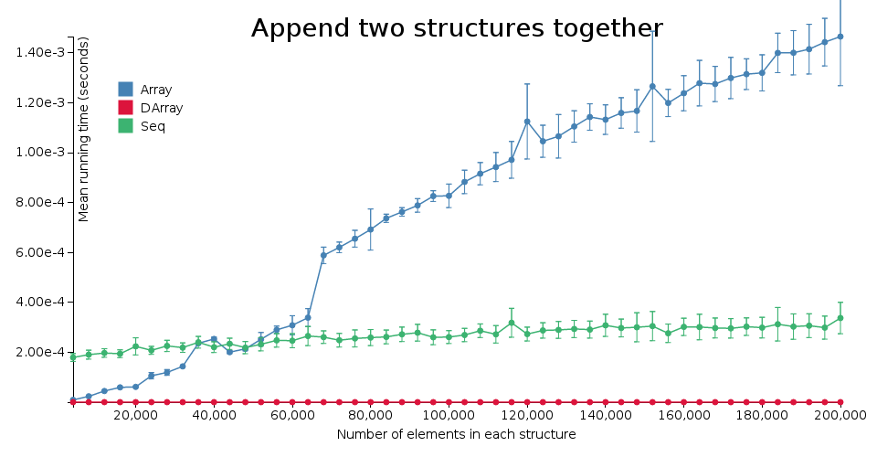
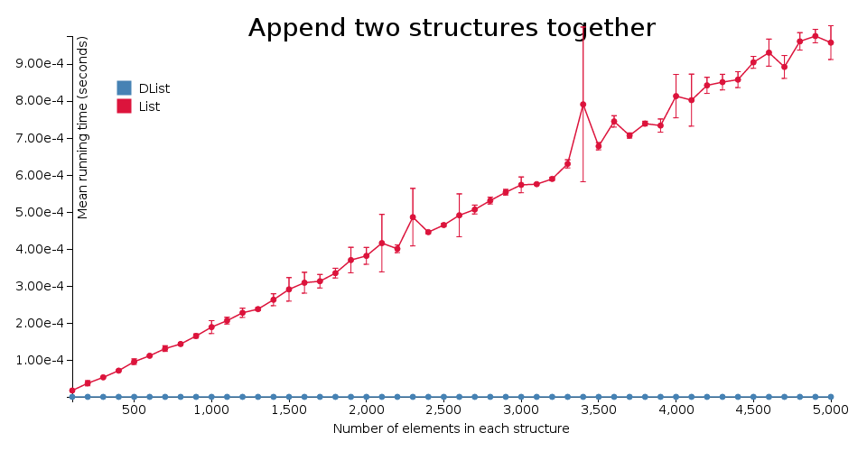

# purescript-difflists [](https://travis-ci.org/Thimoteus/purescript-difflists)

A [difference list](https://wiki.haskell.org/Difference_list) supports fast appending on both sides. A difference list
is just a function that takes a new list and appends it to the "contained" list. This means appending is reduced to
function composition. This is useful if you're appending to the right side many times.

Note however, that transforming to a normal strictly linked list takes linear time.
Therefore, you should only consider using a difference list if you can minimize the number of transformations: for
example, only turn it into a normal list once when you're done appending.

## Benchotron benchmarks




For comparison, [here](http://imgur.com/a/qZwBF#7)
is a benchmark between lists and sequences.

## Installation

```
bower install purescript-difflists
```
